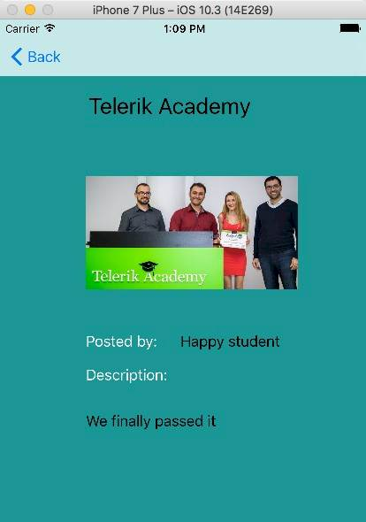

# Holiday Advisor - Your next holiday destination travel app

---------------------------------------------------------------------------------------------------------------------------------

## An iOS course project by Iliyan Gogov
This project is an iOS application which provides you with information about travel destinations. Our users can add a destination where they had been to and give a simple review for it to help future travelers decide where to go next.

---------------------------------------------------------------------------------------------------------------------------------

## Links
##### [ Project's Video](https://youtu.be/bZv7Z3EtbNk)
##### [ HolidayAdvisor in Telerik Showcase](http://best.telerikacademy.com/projects/595/Holiday-Advisor-iOS)

---------------------------------------------------------------------------------------------------------------------------------

## Author

|Name              | http://telerikacademy.com profile                           |https://github.com profile                   |
|:----------------:|:-----------------------------------------------------------:|:-------------------------------------------:|
|Ilian Gogov       |[Iliangogov](https://telerikacademy.com/Users/Iliangogov)    |[iliangogov](https://github.com/iliangogov)  |

---------------------------------------------------------------------------------------------------------------------------------

## Functionalities
 - Check up all posted places live from remote server
 - Check up all registered user live from remote server
 - Add new place live to remote server

---------------------------------------------------------------------------------------------------------------------------------

